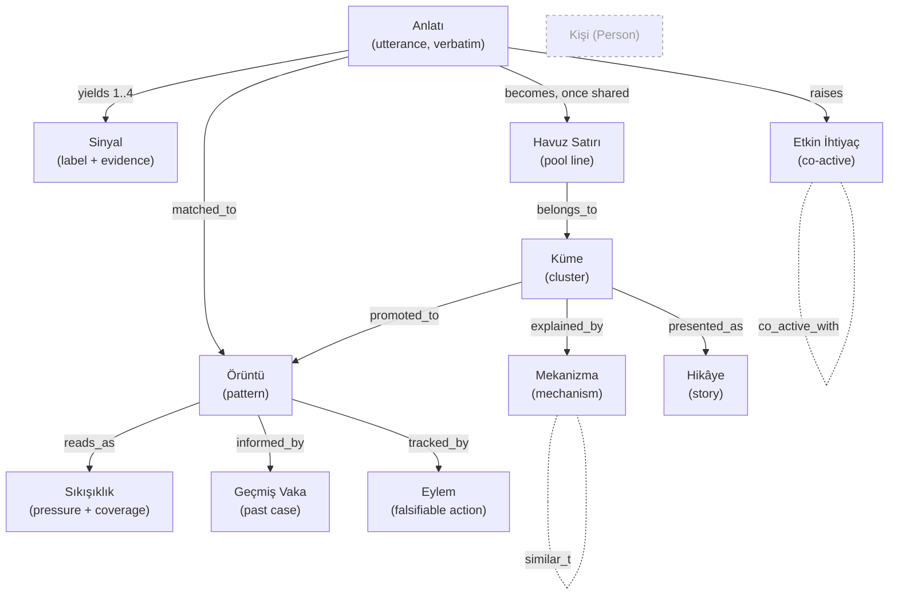

# Fifthback — Ontology

**Status:** documentation only. Nothing in this directory is imported, executed or
referenced by the application. It describes the meaning already encoded in
`backend/server.py` and `frontend/src/{data,lib}`, and names the parts that are
currently implicit.

**Language rule:** domain terms are Turkish, because the product speaks Turkish and a
translated ontology drifts from the copy a user actually reads. Every term carries an
English gloss in parentheses.

---

## 1. What Fifthback is about

Fifthback models **friction in a work system**. It does not model people.

That sentence is the load-bearing commitment of the whole ontology, and it has a
concrete structural consequence:

> **There is no Person entity.** No node, no field, no foreign key, no derived
> attribute. An utterance enters the system already detached from its author, and
> nothing downstream can re-attach it.

Everything else follows from three further commitments already visible in the code:

1. **Evidence before interpretation.** A signal may only claim what an exact quote
   supports (`SYSTEM_PROMPT`: *"evidence çalışanın metninin BİREBİR alt dizesi
   olmalı"*).
2. **Mechanism before topic.** Things belong together because of *why* they happen,
   not because they share words (`PATTERN_ROOM_PROMPT`: *"YÜZEY kelimelere göre
   DEĞİL, altta yatan örgütsel MEKANİZMAYA göre grupla"*).
3. **Absence before invention.** An unmeasured dimension stays `null` and renders as
   "Yeterli veri yok" rather than being estimated (`lib/pressure.js`).

---

## 2. Entity catalogue

Each entity lists: the Turkish term, the English gloss, what it is, and where it is
realised in code today. "—" in the code column means the concept exists in the
product's behaviour but has no named representation yet.

### 2.1 Anlatı (Utterance)

What a person actually said, in their own words, in one sitting.

| | |
| --- | --- |
| Code | `InterpretRequest.text`; the stored `text` in `lib/mySignals.js` |
| Key fields | `text`, `medium` (written / spoken), `song` (optional `SongRef`), `created_at` |
| Identity | none — carries no author reference of any kind |
| Default disclosure | D0, private to the author's browser (see `signal-mapping.md`) |

An Anlatı is the only place verbatim employee language legitimately lives. Every
verbatim quote elsewhere in the system is a substring of one.

### 2.2 Sinyal (Signal)

One evidence-bearing observation: a short neutral label plus the exact span of the
Anlatı that supports it.

| | |
| --- | --- |
| Code | `class Signal(BaseModel)` — `label`, `evidence` |
| Cardinality | 1–4 per Anlatı, capped in the prompt |
| Constraint | `evidence` must be a verbatim substring of the Anlatı |

> **Naming hazard.** The word *sinyal* currently denotes three different things in the
> codebase — see `ambiguities.md` §1. This ontology uses **Sinyal** strictly in the
> sense above, and calls the pattern-room pool entries **Havuz Satırı (Pool Line)**.

### 2.3 Havuz Satırı (Pool Line)

An already-anonymous single-sentence statement in the Pattern Room pool: the 24
seeded examples, plus anything a manager appends.

| | |
| --- | --- |
| Code | `PATTERN_ROOM_SIGNALS`; `pattern_room_meta.pool`; `AddSignalsRequest.signals` |
| Shape | a whole short statement, not a label+evidence pair |
| Relation to Sinyal | a Pool Line is closer to a miniature Anlatı than to a Sinyal |

### 2.4 Mekanizma (Mechanism)

The structural reason a set of statements co-occur. A mechanism is a claim about how
the work system behaves, not a topic label. Controlled vocabulary — see §4.

| | |
| --- | --- |
| Code | `PRCluster.mechanism`, `PRTopPattern.mechanism` (free text today) |
| Governing list | the ten mechanisms enumerated in `PATTERN_ROOM_PROMPT` |
| Extension rule | the prompt permits a new mechanism when evidence does not fit |

### 2.5 Küme (Cluster)

A set of Pool Lines bound by one mechanism. Engine-side object.

| | |
| --- | --- |
| Code | `class PRCluster` — `id`, `name`, `mechanism`, `signal_indices`, `summary`, `is_new`, `changed` |
| Current members | `c1`–`c5` curated, plus `c_new` catch-all for appended lines |

### 2.6 Hikâye (Story)

The human-facing face of a Cluster: a sentence an employee would actually say.
Presentation only — a Story never decides membership.

| | |
| --- | --- |
| Code | `STORY_BY_CLUSTER` in `frontend/src/data/stories.js` |
| Fields | `title` (primary), `mechanism` (secondary label), `why`, `provenance[]` |
| Fallback rule | unknown cluster → the backend's own name, never an invented title |

### 2.7 Örüntü (Pattern)

A cluster promoted to organisational attention, carrying mass, spread, age and status.

Two shapes exist and are **not** interchangeable:

| Shape | Code | Carries |
| --- | --- | --- |
| Pattern-room pattern | `class PRTopPattern` | rank, why_selected/why_formed, inference, uncertain, evidence[], estimated_cost, confidence, past_patterns, next_moves |
| Manager pattern | `class Pattern` | frequency, affected_teams, unresolved_for, blocker, status, feedback_type |

The first is qualitative and mechanism-first; the second is quantitative and
status-first. `lib/pressure.js` has a separate adapter for each precisely because they
do not share fields.

### 2.8 Sıkışıklık (Pressure)

A derived reading over a Pattern: `score`, `band` (high/medium/low/none), `coverage`,
and the components that produced it.

| | |
| --- | --- |
| Code | `computePressure` and its two adapters in `frontend/src/lib/pressure.js` |
| Components | repetition, impact, spread, duration — each may be `null` |
| Rule | weights renormalise over present components only; absent stays absent |
| Rule | POSITIVE or RESOLVED patterns are not reported as friction |

`coverage` is part of the reading, not metadata: a band shown without its coverage is
an incomplete statement.

### 2.9 Etkin İhtiyaç (Active Need)

A need the text supports, held **co-actively** with other needs.

| | |
| --- | --- |
| Code | `class ActiveNeed` — `title`, `detail` |
| Hard rule | needs are never presented as A-vs-B; the schema has no exclusivity edge |

### 2.10 Sorumluluk (Responsibility)

Two lists — `organizational` and `personal` — phrased as possibility, never blame.

| | |
| --- | --- |
| Code | `class Responsibility` |

### 2.11 Kanal (Channel)

A possible next step with an honest trade-off attached.

| | |
| --- | --- |
| Code | `class Channel` — `title`, `detail`, `tradeoff` |
| Safety rule | confronting a manager may never be the only channel offered |

### 2.12 Ayırt Edici Soru (Distinction)

The single question that would most change what the feedback means — asked only when
it would change it.

| | |
| --- | --- |
| Code | `class DistinctionResult` — `should_ask`, `question`, `options[]`, `stop_reason` |
| Rule | options are multi-select; `stop_reason` is a first-class outcome, not a failure |

### 2.13 Temellendirme (Grounding evaluation)

A check on whether a refined interpretation is still supported by the person's own
words.

| | |
| --- | --- |
| Code | `class EvaluateResult` — `supported`, `evaluation_note` |

### 2.14 Geçmiş Vaka (Past Case)

A structurally similar prior case: what was tried, under what conditions it worked,
what changed, and when it failed.

| | |
| --- | --- |
| Code | `class PRPastPattern` — `tried`, `conditions`, `changed`, `when_failed` |
| Note | `when_failed` is required — a case with no failure mode is a slogan |

### 2.15 Eylem (Action)

A tracked, falsifiable intervention against a Pattern.

| | |
| --- | --- |
| Code | `class ActionItem` |
| States | DETECTED → INVESTIGATING → TESTING → RESOLVED \| **REJECTED** |
| Why REJECTED matters | a board with no reject state cannot disconfirm anything |

### 2.16 Yaygınlık (Prevalence)

Whether an interpretation matched a real seeded pattern, and that pattern's real
numbers. Never synthesised.

| | |
| --- | --- |
| Code | `class Prevalence`; `_match_prevalence` (5-char Turkish stem overlap, threshold ≥ 2) |
| Rule | no match → `found=False` and an honest empty state |

### 2.17 Non-entities

Deliberately absent, and to stay absent:

- **Kişi (Person)** — no identity, no pseudonymous stable id, no department, no age,
  no gender (`ENTRY.privacy`).
- **Performans / motivasyon / kişilik** — explicitly refused in both prompts and in
  `MANAGER.never`.
- **Duygu durumu (mood diagnosis)** — the interpreter is *"bir ayna, yargıç değil"*.

---

## 3. Relation catalogue

Direction is source → target. "Forbidden" names the edge that must **not** exist.

| Relation | Source → Target | Cardinality | Notes |
| --- | --- | --- | --- |
| `yields` | Anlatı → Sinyal | 1 → 1..4 | extraction |
| `quotes` | Sinyal → Anlatı | 1 → 1 | verbatim substring; the evidence link |
| `raises` | Anlatı → Etkin İhtiyaç | 1 → 1..4 | co-active |
| `co_active_with` | İhtiyaç ↔ İhtiyaç | n ↔ n | symmetric. **Forbidden:** `excludes` |
| `belongs_to` | Havuz Satırı → Küme | 1 → 0..1 | unassigned lines sit in `c_new` |
| `explained_by` | Küme → Mekanizma | 1 → 1..n | today a free-text join of terms |
| `presented_as` | Küme → Hikâye | 1 → 0..1 | absent mapping falls back to backend name |
| `promoted_to` | Küme → Örüntü | 1 → 0..1 | ranked by the Impact role |
| `reads_as` | Örüntü → Sıkışıklık | 1 → 1 | derived, may be `band: none` |
| `matched_to` | Anlatı → Örüntü | 1 → 0..1 | via `_match_prevalence`, stem overlap ≥ 2 |
| `informed_by` | Örüntü → Geçmiş Vaka | 1 → 0..n | precedent, not prescription |
| `tracked_by` | Örüntü → Eylem | 1 → 0..n | falsifiable |
| `similar_to` | Mekanizma ↔ Mekanizma | n ↔ n | 5-char stem overlap; drives map distance |
| `refines` | Temellendirme → Yorum | 1 → 1 | may downgrade, never invent |
| `gated_by` | any aggregate → Eşik | — | see `signal-mapping.md` §4 |
| **Forbidden** | anything → Kişi | — | no such target exists |
| **Forbidden** | Sinyal → Sinyal (`caused_by`) | — | causality between signals is not extractable from one text |

---

## 4. Mechanism vocabulary

The authoritative list is the one enumerated in `PATTERN_ROOM_PROMPT`. Each entry
below adds what the code does not state: a **distinguishing test** — the question that
separates this mechanism from its nearest neighbour. Without such a test, mechanism
assignment collapses back into keyword matching, which is exactly what the product
claims not to do.

| id | Turkish | English gloss | Distinguishing test |
| --- | --- | --- | --- |
| `karar-gecikmesi` | karar gecikmesi | decision latency | Is the work *waiting on a decision that exists but has not been made*? If the decision has been made and is merely unknown, it is `bilgi-boslugu`. |
| `belirsiz-sahiplik` | belirsiz sahiplik | unclear ownership | Would the work move if *one named party* accepted it? If it would still not move because no one knows what to decide, it is `karar-gecikmesi`. |
| `devir-surtusmesi` | devir sürtüşmesi | handoff friction | Does the loss happen *at the boundary* between two teams, at the moment of transfer? Continuous ambiguity is `belirsiz-sahiplik`. |
| `yeniden-is` | yeniden iş (rework) | rework | Was finished work *redone*? If it was never finished because it kept waiting, it is `karar-gecikmesi`. |
| `yetkinlik-uyumsuzlugu` | yetkinlik uyumsuzluğu | skill mismatch | ⚠️ See `ambiguities.md` §6 — this is the one mechanism that can slide into judging people. Use only for a *structural* mismatch (work routed to a team without the capability), never for an individual. |
| `kapasite-kisiti` | kapasite kısıtı | capacity constraint | Would *more hands* actually move it? If adding people has already failed to help, it is `onceliklendirme-catismasi`. |
| `bilgi-boslugu` | bilgi boşluğu | information gap | Does the needed fact *exist somewhere* but cannot be found? If it does not exist yet, it is `karar-gecikmesi`. |
| `surec-tekrari` | süreç tekrarı | process duplication | Is the *same output produced twice in parallel*? Sequential redoing of one output is `yeniden-is`. |
| `onceliklendirme-catismasi` | önceliklendirme çatışması | prioritisation conflict | Is everyone busy while specific work sits untouched? That pattern separates it from `kapasite-kisiti`. |
| `arac-sistem-surtusmesi` | araç/sistem sürtüşmesi | tool/system friction | Does the friction persist *after* the information is found — in moving it between systems? Otherwise `bilgi-boslugu`. |

Current cluster → mechanism assignment (from `_curated_pattern_room`):

| Cluster | Mechanism string in code | Normalised ids |
| --- | --- | --- |
| c1 Karar Akışı / Sahiplik Darboğazı | `karar gecikmesi + belirsiz sahiplik` | `karar-gecikmesi`, `belirsiz-sahiplik` |
| c2 Yeniden İş Döngüsü | `yeniden iş (rework)` | `yeniden-is` |
| c3 Sahiplik & Devir Karışıklığı | `belirsiz sahiplik + devir sürtüşmesi` | `belirsiz-sahiplik`, `devir-surtusmesi` |
| c4 Kapasite vs. Öncelik | `kapasite kısıtı + önceliklendirme çatışması` | `kapasite-kisiti`, `onceliklendirme-catismasi` |
| c5 Bilgi & Araç Kopukluğu | `bilgi boşluğu + araç/sistem sürtüşmesi + süreç tekrarı` | `bilgi-boslugu`, `arac-sistem-surtusmesi`, `surec-tekrari` |

The adapter layer uses *different wording* for the same clusters — `geç geri bildirim`,
`akış tıkanması`, `öncelik belirsizliği`, `araç kopukluğu`. Those strings are not in
the engine's vocabulary. See `ambiguities.md` §3.

---

## 5. Invariants

Each invariant states the rule, where it is enforced today, and how it would be
observed to fail. These are descriptive of current behaviour, not new requirements.

| id | Rule | Enforced in | Observable failure |
| --- | --- | --- | --- |
| INV-01 | `Signal.evidence` is a verbatim substring of the Anlatı | `SYSTEM_PROMPT`; `_fallback_interpret` | a quote appears that the person never typed |
| INV-02 | Needs are co-active; never an A/B dilemma | `SYSTEM_PROMPT`; `DISTINCTION_PROMPT`; multi-select options | UI offers mutually exclusive needs |
| INV-03 | No person is modelled, scored or diagnosed | both prompts; `MANAGER.never`; no Person entity | any per-individual attribute appears |
| INV-04 | No fabricated statistic, benchmark or currency figure | `SYSTEM_PROMPT`; `_match_prevalence`; `estimated_cost` stays qualitative | a number appears with no engine field behind it |
| INV-05 | Aggregates are gated by anonymity thresholds | `lib/privacy.js` (5 / 8 / 4 / 2 + complement suppression) | a breakdown renders below threshold |
| INV-06 | Displayed provenance is paraphrased, never verbatim | `STORY_BY_CLUSTER[*].provenance`; `DETAIL.provenanceNote` | a real employee sentence is shown to a manager |
| INV-07 | Unknown input falls back to the engine's own name | `humanTitle`, `secondaryLabel`, `whyTogether` | an invented title appears for an unmapped cluster |
| INV-08 | POSITIVE / RESOLVED are not reported as friction | `pressureFromManagerPattern` `isFriction` | praise shows a sıkışıklık band |
| INV-09 | Unmeasured dimensions stay null and say so | `computePressure`; `PRESSURE.none` | a guessed value fills a gap |
| INV-10 | Every promoted pattern is rejectable | `ActionItem.status` includes REJECTED | the board can only ever confirm |
| INV-11 | No channel requires confrontation as the only path | `SYSTEM_PROMPT`; `safety_note` | the sole suggestion is to confront a manager |
| INV-12 | Interventions are offered as precedent, not prescription | `next_moves` phrasings; `PRPastPattern.when_failed` | "this is the solution" phrasing appears |

---

## 6. Lifecycles

Three state machines exist, and they are **not** the same machine. Conflating them is
a live risk (`ambiguities.md` §5).

**Employee-side story state** — `lib/mySignals.js` / `copy.js STATES`:

```
NEW → MATCHED → FOLLOWING → SHARED → MOVING → RESOLVED
```

Owned by the person. `SHARED` is a disclosure change, not progress.

**Manager pattern status** — `class Pattern`:

```
NEW → ACTIVE → STUCK → RESOLVED
```

Owned by the organisation. `STUCK` is the only state that increases pressure.

**Action board status** — `class ActionItem`:

```
DETECTED → INVESTIGATING → TESTING → RESOLVED | REJECTED
```

Owned by whoever runs the intervention. This is the only lifecycle with a
disconfirming terminal state.

---

## 7. The model as a graph



The dashed, unconnected `Kişi` node is the point of the diagram: it has no edges,
because nothing in the system may point at it.

---

## 8. What this ontology does not yet cover

Recorded here so the gaps are visible rather than assumed away; expanded in
`ambiguities.md` and `research-agent-brief.md`.

- **Konuşma maliyeti (cost of speaking up).** Declared as a manager axis
  (`MANAGER.axes.voice`) but never measured — `pressure.js` hardcodes
  `speakingCost: null`. There is no mechanism in the vocabulary for it either.
- **Positive mechanisms.** `POSITIVE` is a valid `feedback_type` and the dictionary
  carries two positive phrases, but every mechanism in the vocabulary names a
  friction. Praise currently has nowhere to cluster.
- **Time.** Patterns carry `unresolved_for` as free text; there is no event log, so
  "is this getting worse?" is not answerable, only "is it flagged STUCK?".
- **Cross-organisation comparison.** Deliberately out of scope for now; any external
  corpus is barred from contributing mass (see `signal-mapping.md` §4.3).
